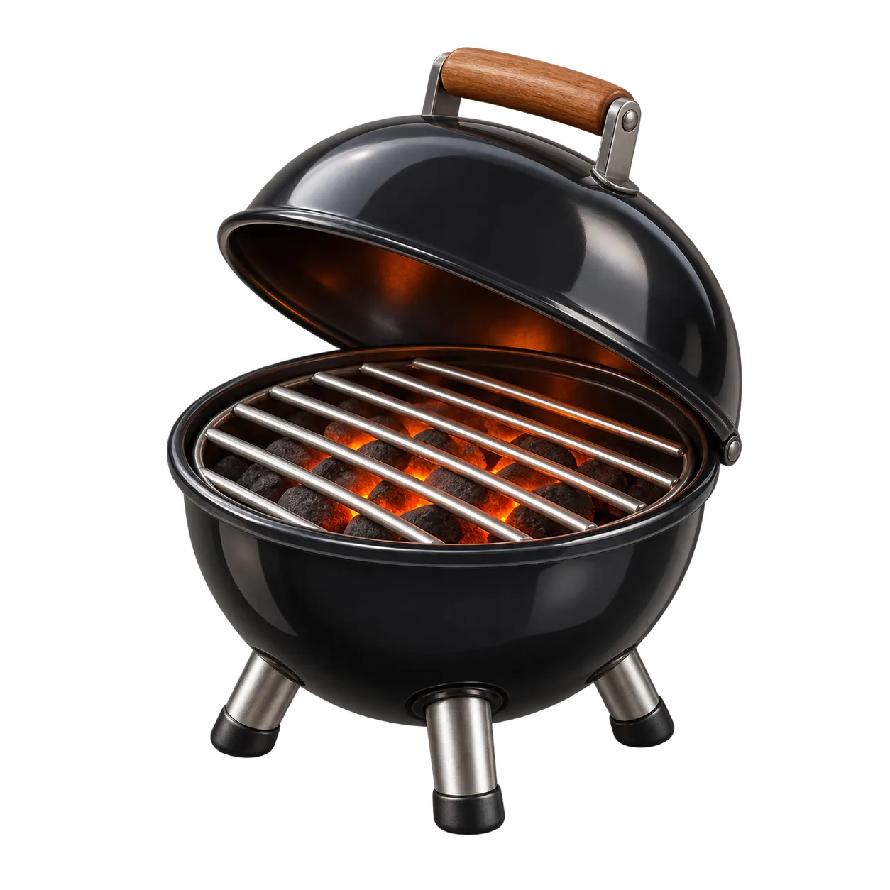

<p align="center">
  
</p>

# The Grill

**Measure how fast a serving setup runs an LLM, then compare setups.**

A serving setup is the engine plus its settings, such as vLLM with a quantized model at a given context length. Run the same test on each setup, then compare the saved results.

| I want to... | Use | What you get |
|---|---|---|
| Check whether a serving setup is faster | [Speed benchmarks](#speed-benchmarks)<br>`grill-perf`  | Time per request group, combined tokens per second, comparison of saved runs |
| Check whether a model answers tasks correctly | [Quality evaluation](#quality-evaluation-wip)<br>`grill`  | Graded answers, with wrong, refused, cut-off, and missing results kept separate |

Both tools run on your machine and connect to a server you already run. No project account or results upload is required. **This is experimental software.**

## Get started

You need **Linux, Rust/Cargo 1.98, a C/C++ toolchain, and CMake**.

```sh
git clone https://github.com/plotarmordev/thegrill.git
cd thegrill
cargo build --workspace --release --locked
mkdir -p results
```

Start your model server first. In the examples below, replace port `8000` and `your-model` with your server's settings. The Grill does not start or change your server.

<details>
<summary><strong>Using a remote server or an API key?</strong></summary>

- For a remote server, use its HTTPS URL or a separately managed local forward. `--local-http` permits HTTP only on literal loopback addresses such as `127.0.0.1`.
- If a key is needed, set `MODEL_API_KEY` in your environment and add `--auth-env MODEL_API_KEY` to the run command. Do not put the key in a workload file.

</details>

## Speed benchmarks

Use **`grill-perf`** to capture a baseline, make one serving change yourself,
and check the result. It never starts or changes your server.

Record the current serving identity in `serving-before.json`. Use real IDs or
fingerprints for these four declarations, not secrets:

```json
{
  "model_revision": "weights-r1",
  "runtime": "server-build-r1",
  "hardware": "device-layout-r1",
  "settings": "configuration-r1"
}
```

**1. Capture the baseline** against a running vLLM-compatible Chat Completions
endpoint:

```sh
target/release/grill-perf baseline \
  --endpoint http://127.0.0.1:8000/v1/chat/completions \
  --local-http --model your-model \
  --deployment serving-before.json --out before
```

**2. Make your serving change.** Save the updated declaration as
`serving-after.json`, changing the corresponding field and keeping the others.

**3. Check it:**

```sh
target/release/grill-perf check before \
  --deployment serving-after.json --change settings --out after
```

`check` inherits the baseline's endpoint, model, workload and credential-environment
name. Select `model_revision`, `runtime`, `hardware` or `settings` as the declared
change. Unexplained mismatches are rejected before candidate requests.

| Result | Meaning |
|---|---|
| **IMPROVED** | The comparison model supports an observed throughput increase between these capture periods |
| **REGRESSED** | It supports an observed decrease between these periods |
| **INCONCLUSIVE** | No direction is supported, or the fixed budget left insufficient evidence; this does not establish equality |
| **INVALID** | Response, identity or evidence checks failed; the report identifies why and retains the available evidence |

Observed percentages are separate from the model-based interval. Sequential
captures cannot isolate the serving change from time, load or cache effects.
The result is not a causal certificate or a guarantee of detecting a 5% change.

The default is one short structured **C1** workload: eight acquisitions, each
with one warmup and three measured requests, requiring actual reported output
of 400 tokens/request. Each capture allows **32 requests, 12,800 output tokens
and 300 seconds**, including warmups. Slower servers can use an explicit larger
`--seconds` allowance; completing the default needs more than 42.7 output tokens/s
including overhead. There are no automatic retries or replacement samples.

Reports and raw evidence stay local in `before` and `after`. To recheck them
offline without contacting the server:

```sh
target/release/grill-perf compare before after --json
```

[Full performance guide and measurement limits](docs/performance/README.md).
Advanced `run`, `pause`, `resume`, raw-run `compare`, and captured-policy `decide`
remain separate workflows. The [shared recipes](docs/performance/SHARED-RECIPES.md)
retain their [sparkDash](https://github.com/MiaAI-Lab/sparkDash) attribution and
original observed-envelope semantics; they are not the new default assessment,
and historical results are not reinterpreted.

## Quality evaluation (WIP)

Use **`grill`** to collect model answers and check them against task rules.

**This part is a work in progress.** The included questions are synthetic examples, not a validated intelligence test. It currently supports text answers, not agents or code execution.

```sh
target/release/grill run examples/synthetic-pack.json \
  --endpoint http://127.0.0.1:8000/v1/chat/completions \
  --local-http --model your-model --token-cap 4096 --stream \
  --out results/answers

target/release/grill inspect results/answers --json
target/release/grill regrade results/answers --out results/answers-regraded
```

Inspection and regrading use saved files. They do not call the model again. Wrong answers, refusals, cut-off responses, and missing results stay separate.

[Task formats and quality evaluation guide](docs/PROJECT.md)

## Keep your results safe

Use a new output directory for each run. Results contain prompts and model responses, so review them before sharing.

[Contributing](CONTRIBUTING.md) · [Code organization](docs/REPOSITORY.md) · [Security](SECURITY.md) · [MIT license](LICENSE)

MIT covers this project's code and documentation. Benchmark data and model weights keep their own licenses.
