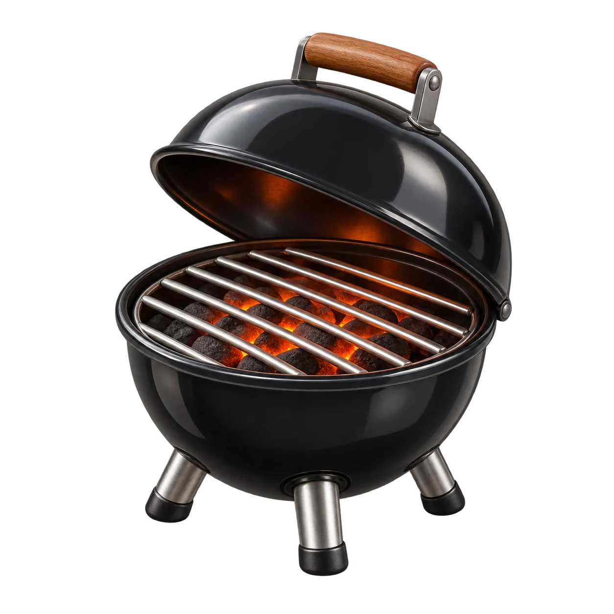

<p align="center">
  
</p>

# The Grill

**Measure how fast a serving setup runs an LLM, then compare setups.**

A serving setup is the engine plus its settings, such as vLLM with a quantized model at a given context length. Run the same test on each setup, then compare the saved results.

| I want to... | Use | What you get |
|---|---|---|
| Check whether a serving setup is faster | [Speed benchmarks](#speed-benchmarks)<br>`grill-perf`  | Time per request group, combined tokens per second, comparison of saved runs |
| Check whether a model answers tasks correctly | [Quality evaluation](#quality-evaluation-wip)<br>`grill`  | Graded answers, with wrong, refused, cut-off, and missing results kept separate |

Both tools run on your machine and connect to a server you already run. No project account or results upload is required. **This is experimental software.**

## Works on

| Platform | How to install | What works |
|---|---|---|
| Linux x86_64 and aarch64 (Ubuntu 24.04) | [Release archive](https://github.com/plotarmordev/thegrill/releases/tag/v0.5.0), no Rust needed | Everything in `grill-perf` (opt-in Python producers need their own runtime) |
| Apple Silicon macOS | Release archive from the next release (unsigned; no notarization); source build until then (below) | Serving speed and deployment comparison; macOS memory observation. Linux resource and external-program collectors are not available |

`grill-perf` talks to any OpenAI-compatible Chat Completions server that reports
streaming token usage. It has been run against vLLM, TensorFold (on NVIDIA and on
Apple Silicon) and oMLX. It never starts, configures or restarts your server.

The latest pre-release is [v0.5.0](https://github.com/plotarmordev/thegrill/releases/tag/v0.5.0).
Earlier releases stay available; an older binary does not contain newer features.

## Quick start

**Linux:** download and verify the release archive as described in
[Install and first capture](docs/performance/INSTALL.md#obtain-verify-unpack), then
set `GRILL_PERF` to its `bin/grill-perf`.

**macOS:** build from a clean clone so the binary records its source commit
(needs Rust/Cargo 1.98, C/C++ tools and CMake):

```sh
git clone https://github.com/plotarmordev/thegrill.git && cd thegrill
git checkout v0.5.0
cargo build --release --locked -p grill-perf
export GRILL_PERF="$PWD/target/release/grill-perf"
"$GRILL_PERF" --version   # grill-perf 0.5.0 (source b00e6cff...)
```

**Then, on either platform,** describe your server once and capture a baseline
next to it:

```sh
mkdir -p results
jq -n --arg m "your/model@revision" --arg r "engine and version" \
  --arg h "device" --arg s "serving flags" \
  '{model_revision:$m, runtime:$r, hardware:$h, settings:$s}' > serving.json
"$GRILL_PERF" baseline --workload portable-v1 --client-placement same-host \
  --endpoint http://127.0.0.1:8000/v1/chat/completions --local-http \
  --model your-model --deployment serving.json --out results/before
```

Change your server yourself, then `check` and `compare` the saved runs. The full
walk-through, including an unchanged control run, is in
[Install and first capture](docs/performance/INSTALL.md#baseline-optional-control-change-check).

## Example: the same model on a Mac and on a DGX Spark

Qwen3.8-Flash-Next, the same 4-bit MLX checkpoint (`Vontra/...-MLX-4bit-MTP@dadefa80`),
served by TensorFold 0.6.0 on each machine, measured with the same `grill-perf`
source build, client on the serving host
([A/B/A2 deployment comparison](docs/performance/INSTALL.md#compare-two-deployments-aba2)):

| | DGX Spark (GB10) | Mac Studio (M5 Ultra) |
|---|---|---|
| `portable-v1`, one request at a time | 118 tok/s | 246 tok/s |
| Verdict | | **MEASURED FASTER**, +108.7% (95% range +107.9% to +109.6%) |
| Repeat of the Spark run (drift control) | -0.2% | |
| sparkDash decode, 4 requests at once (descriptive) | 350 tok/s total | 354 tok/s total |
| sparkDash prefill, 4K-32K (descriptive) | 2,340-2,450 tok/s | 2,870-2,960 tok/s |

This compares whole deployments, not chips: the Mac's TensorFold build rejected
two settings the Spark used (int8 KV cache and an MTP confidence threshold), and
the counting prompt favours speculative decoding. Verdicts cover the built-in
single-request workload; selected workloads such as the sparkDash copies are
descriptive side-by-side results (the Mac's sparkDash runs completed 3 of 8 rounds).

## Speed benchmarks

Use **`grill-perf`** against a server you already run. `check` reuses the
baseline's endpoint, model, workload and credential-variable name. Deployment
details are what you declare, not something the tool verifies.

**Workloads.** The default is a short structured single-request (C1) check;
`portable-v1` is the same idea for servers that do not support exact-length
controls, such as MLX servers. Selected workloads, all descriptive, include:

- `sparkdash-decode-portable-v2` and `sparkdash-prefill-portable-v1`: the
  [sparkDash](https://github.com/MiaAI-Lab/sparkDash) tests, matching sparkDash 1.8.7;
- `prefill-prose-portable-v1`: the same prefill sizes with varied text instead of
  one repeated word;
- realistic coding and edit prompts, a C1-C8 concurrency ladder, long-context
  decode and prefill, and conversation history checks.

See the [selection list](docs/performance/INSTALL.md#optional-selections-and-failures)
and [recipe embedding](docs/performance/RECIPES.md). Contributors making
performance claims start from the [shared claim map](docs/performance/SHARED-RECIPES.md)
and [report template](docs/performance/SHARED-REPORT-TEMPLATE.md).

**Results.**

| Display label | JSON `result` code | Meaning |
|---|---|---|
| **MEASURED FASTER** | `IMPROVED` | Higher measured throughput between these capture periods |
| **MEASURED SLOWER** | `REGRESSED` | Lower measured throughput between these periods |
| **COMPLETE - DESCRIPTIVE ONLY** | `DESCRIPTIVE` | A selected comparison completed; no faster/slower verdict |
| **INCONCLUSIVE** | `INCONCLUSIVE` | No direction established, or not enough evidence; not the same as "equal" |
| **VERDICT PENDING** | `PENDING` | A deployment candidate is captured; the verdict needs the unchanged reference run |
| **INVALID** | `INVALID` | Response, identity or evidence checks failed; the report says why |

A direction is not a cause: sequential runs cannot separate your change from time,
load or cache effects, and there is no guaranteed precision. Runs have a fixed
time and request budget with no automatic retries; reports and raw evidence stay
on your machine, and `compare` re-checks saved runs without network calls.

[Full performance guide and measurement limits](docs/performance/README.md).

## Quality evaluation (WIP)

Use **`grill`** to collect model answers and check them against task rules.

**This part is a work in progress.** The included questions are synthetic examples, not a validated intelligence test. It currently supports text answers, not agents or code execution.

Build this separate source-only CLI on Linux with Rust/Cargo 1.98, a C/C++
toolchain and CMake; it is not shipped in the performance archive:

```sh
git clone https://github.com/plotarmordev/thegrill.git
cd thegrill
cargo build -p grill --release --locked
mkdir -p results
```

Start your server separately. Replace the endpoint and model selector below.
For remote use, select HTTPS; local HTTP requires a literal loopback address.
If authentication is required, supply the credential independently in your
environment and add `--auth-env NAME` to `run`, never the key itself.

```sh
target/release/grill run examples/synthetic-pack.json \
  --endpoint http://127.0.0.1:8000/v1/chat/completions \
  --local-http --model your-model --token-cap 4096 --stream \
  --out results/answers

target/release/grill inspect results/answers --json
target/release/grill regrade results/answers --out results/answers-regraded
```

Inspection and regrading use saved files. They do not call the model again. Wrong answers, refusals, cut-off responses, and missing results stay separate.

[Task formats and quality evaluation guide](docs/PROJECT.md)

## Keep your results safe

Use a new output directory for each run. Results contain prompts and model responses, so review them before sharing.

[Contributing](CONTRIBUTING.md) · [Code organization](docs/REPOSITORY.md) · [Security](SECURITY.md) · [Apache 2.0 license](LICENSE)

Apache License 2.0 covers this project's code and documentation; releases up to v0.5.0 were published under MIT. Benchmark data and model weights keep their own licenses.
